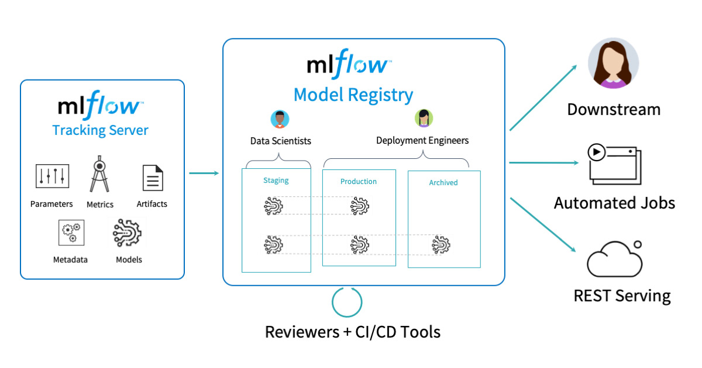
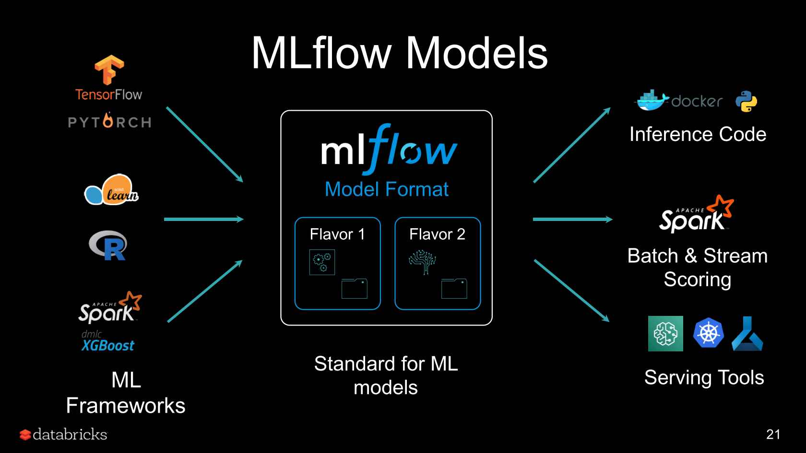

### Experiment Tracking Notes: 

There are many packages that can assist with experiment tracking, for this section I'll be using Mlflow. We've previously used TensorFlow extended. 

#### What is MLFlow? 

MlFlow can be thought of as a tool to track:

- Different models developed by data scientists.
- Metrics/parameters used to develop models. 
- Different deployments and rolling back. 

#### Key Concepts:

- ML Experiment: The process of building an ML model. 
- Experiment Run: Is a model training process with some set of hyperparameters and some set of data. (An ML experiment is a collection of experiment runs)
- Run Artifact: A file that is associated with an ML run, eg: could be a config file of hyperparams, or if data is queried from a SQL database then could be a file with the query used. 
- Experiment Metadata: Summary stats/metrics of the experiment run eg: the accuracy, F1 score, time to train, time for inference etc. 

#### Motivations for Experiment Tracking:

- Reproducibility: once we've built a model we want to be able to recreate this model in a production environment - experiment tracking keeps track of the training data used, hyperparams, model architecture, model params.. etc. 
- Orgnisation/Optimisation: Allows team members to know which model runs have been done and what other models we wish to try to improve on current version. 

#### MlFlow:

Installation and basics:

- MlFlow can be installed using pip. 
- Check installation with "mlflow" in terminal. 
- Running "mlflow ui" in terminal will start the local version of mlflow and can open a webpage for the mlflow gui. 
- Recall from our ML Ops course with Andrew Ng, packages like mlflow and TFX have a metadata store. A metadata store is a sql database that stores the data lineage. Ie: as data passes from component to component we want to keep track of the steps used, this tracking is done using s SQL database. 
- To ensure mlflow runs with this backend database we need to use the command: "mlflow ui --backend-store-uri sqlite:///mlflow.db" Also need to set this in python if using within a notebook. (mlflow.set_tracking_uri("sqlite:///mlflow.db"))
- Note set tracking_uri first before anything else. This allows mlflow to update the correct db file and then mlflow will correctly display the information on the ui. 
- When starting the mlflow ui you can also pass the flag "--port" to specify the port that you want the mlflow ui to run on. 
- Once we start using the mlflow within a notebook, the "mlflow.db" file should be created and running mlflow ui command in terminal will start the mlflow interface with the data from the database.
- When using mlflow within a notebook, we need to set the "ML Experiment" that we are working in. This is so mlflow can store our models/experiment runs under the correct project. 

#### Logging Hyperparams and Metrics:

- To begin using mlflow once imported, within our training block of code, we need to wrap it in a special mlflow context manager. 
- Some common logging syntax within the mlflow context manager: "mlflow.log_param(""PARAMETER_NAME"", ""PARAMETER_VALUE"")
- Similarly: mlflow.log_metric(""METRIC_NAME"", ""METRIC_VALUE"")
- For logging artifacts like a pickle'd version of a model we have: mlflow.log_artifact(""LOCAL_PATH"", ""ARTIFACT_PATH"")
- You can add tags to model runs, based on the type of model: eg if we only wanted to look at tree based models could do: mlflow.set_tag("model_type", "tree")
- In the Mlflow ui can use: tags.model_type = "tree", to see all models that are tree based.
- Within the Mlflow UI can see the different combinations of hyperparameters used, and how this has affected the logging metrics. Eg: if we wanted to see how learning rate has impacted the RMSE. 
- For some ML frameworks: sci-kit learn, XGBoost, PyTorch, TensorFlow etc we have "AutoLogging" so if a model is trained using any of these frameworks can enable automatic logging in MlFlow. eg for XGBoost we would use: mlflow.xgboost.autolog().
- AutoLogging is super powerful in the sense that it will track all hyperparams, metrics and even creates an MLFLow Model so we can deploy, a requirements.txt and even information on feature importance. 

If correctly setup we should have something like:

#### Model Management:

- As mentioned previously we can save models using the pickle library. To make this file shareable we can use the log_artifact method of mlflow to store this on our UI and furthermore make it available to other data scientists. 
- Though logging artifacts is okay, what if we had multiple versions pickled? What was the environment used to create the model? What preprocessing was needed? 
- To account for this, we can use built in methods for Mlflow. The format goes: "mlflow.xgboost.log_model(model_object, artifact_path)" - changing the framework from xgboost to whatever has been used. This like autologging, tracks the dependencies, environment information, and also the model artifact. 
- We can also use the mlflow.log_artifact method to store python objects needed for preprocessing: eg: OneHotEncoders, RobustScalers etc.
- By managing our models like this, then we have everything we need to provide inference and track models. 
- Furthermore, this method provides an API to Pandas and PySpark: by using the run URI (unique resource identifier), we can load the model into Python and use it for inference on PySpark and Pandas dataframes. (Loads into PySpark as a UDF)
- We can also load the model in as a Python function OR as an object of the framework we used to train. Eg: can load an XGBoost model as a python function OR as an XGBoost model. (These are calls "model flavours". - either as a Python function or a model from the framework we used.)

#### Model Registry:

- The model registry part of MlFlow refers to the second part of our initial diagram. In particular: the model registry allows us to track which models are in staging, production and archived whcih then allows us to rollback to previous deployments. 
- MlFlow runs track: 
    1. Model sizes.
    2. Training times. 
    3. Metrics. 

These need to be factored when choosing which models move into the Model registry. We know that accuracy/performance is not everything: a model with many parameters may have the best performance but a poorer latency/throughput. Larger models in terms of megabytes will require bigger Docker containers and cost more money to deploy these models. 

- Note that model registry isn't a tool to deploy models: it's a tool to track the models in staging, production and previous deployments. 
- Within the logged model artifacts section, we can move our models into the model registry. 
- Within the model registry tab we can see all models in the model registry, add comments about the model and even set tags. 
- Note to interact with MLFlow we don't have to use the webpage. As all runs data is passed into a database, we can use MlFlow client to interact with the UI. 
- Remember you need to pass the database to MlFlowClient so it has access to runs/experiments!!!!
- In particular we can add experiments, delete experiments, view runs, move runs into model registry and vice versa. 
- We can do even cooler things with the MlFlow Client: Filtering on runs where a metric is within some limits. eg: "metrics.rmse < 7" or "metrics.f1 > 0.9". 

The model registry at a high level has a "Model", this can be thought of as a container for all models relating to this project. Eg we may have 2 models: "Loan Predictions", "House Prediction" - both different from each other. It's a way of isolating projects from each other. 

The model registry has 4 options for each trained model:

- None: the model is in model registry but not in staging/production/archived.
- Staging: the model is likely to move into production. 
- Production: model is live. 
- Archived: the model has been replaced by another version. 

A bit like git commit messages, if moving models between staging/production: write messages to inform team as to why and when. (Add in "description" section. )

#### MlFlow in Practice:

When using MlFlow you should consider the following:

- Do I need a database for tracking my experiment information like SQLLite, or is storing on my file system enough? Furthermore if you've chosen to use a database, do you need a cloud database or is a local one enough? 
- Similarly: do I need a remote artifacts store or a remote tracking server?

The answer to these should depend on how collaborative the project is - if the project is a solo one then storing things locally should be enough. However if working in a greater team with multiple projects then using cloud tools is essential. Note: if you use the MlFlow without the database backend then you won't be able to access the Model registry. 

The mlruns directory contains the folders on information on runs/metrics/params. 

If you want to run mlflow remotely you would:

- Setup a database (postgres/SQLlite) on a cloud platform, that way your tracking server can find the database globally. 
- Create an artifact store on the cloud: GCP has it's own dedicated section however you could just use an S3 bucket. 
- On our EC2/GCE instance, we start Mlflow by setting the backend to the database we've created. Doing this will start the server on the instance on a particular port.
- Then we can use our IP address of the instance along with the port number that the server is running on to view the Mlflow system globally. 

#### Limitations of MlFlow:

- Unlike TFX, Mlflow doesn't come with data versioning tools which can make it somewhat tricky to reproduce a model. 
- Along with not being able to track tabular datasets, can't track unstructed datasets like images/audio/text. 